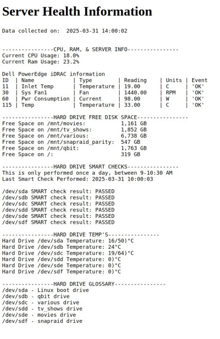

# Server-Health-and-Memory-Space-Check

This is a python script I wrote that runs every hour everyday (triggered by a cron job) and updates an HTML page that I can view anytime to see the status of my server.  In addition once a day in the morning it sends the output of the HTML page to my Telegram messaging account.  This keeps me updated on the status of various aspects of the server, including: 
- CPU usage
- memory usage
- cpu temperature
- fan speed
- free hard drive space
- hard drive SMART checks

The advantage with this script is that it is automated, all relevant information is on one page, always available, and even sent to me daily keeping me up to date without having to think to check.
